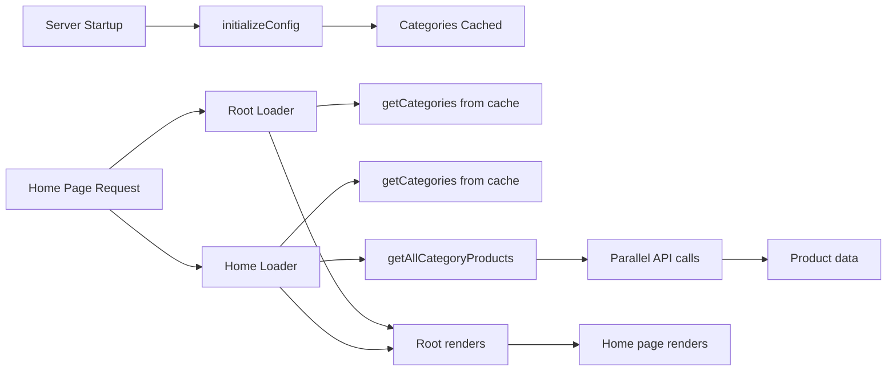
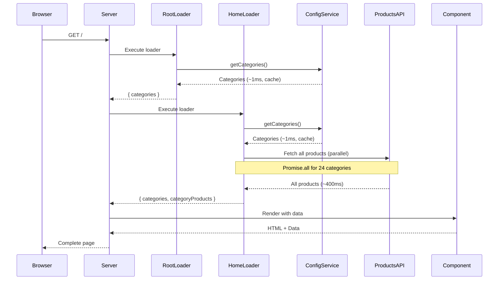

# Data Fetching Guide: Home Page

> Best practices and patterns for data fetching in React Router 7 applications

**Created**: February 17, 2026  
**Status**: ✅ **PRODUCTION READY**  
**React Router**: v7.12.0  
**Scope**: Home page data fetching patterns

---

## Table of Contents

- [Overview](#overview)
- [Home Page Data Architecture](#home-page-data-architecture)
- [Data Flow](#data-flow)
- [Implementation Details](#implementation-details)
- [Performance Optimizations](#performance-optimizations)
- [Best Practices](#best-practices)
- [Common Patterns](#common-patterns)
- [Error Handling](#error-handling)
- [Testing Strategy](#testing-strategy)
- [Advanced Techniques](#advanced-techniques)

---

## Overview

### What Data Does the Home Page Need?

The home page requires two types of data:

1. **Categories** (from unified config system)
   - Source: Remote API (DummyJSON)
   - Initialized: Server startup
   - Access: Runtime cache (~1ms)
   - Purpose: Navigation + product organization

2. **Products by Category** (from API)
   - Source: Remote API (DummyJSON)
   - Fetched: Per request in loader
   - Access: Parallel fetch for all categories
   - Purpose: Display product listings

### Key Principles

This guide follows these React Router 7 data fetching principles:

1. **Loaders for Server-Side Data**: All data fetching happens in route loaders
2. **Type-Safe Data Flow**: Automatic type generation from loader to component
3. **Parallel Fetching**: Multiple requests executed simultaneously
4. **Cache-First Strategy**: Reuse cached data when available
5. **SSR-Friendly**: All data ready before HTML sent to browser
6. **Error Boundaries**: Loader errors caught by React Router automatically

### Performance Goals

- ✅ **First Request (Cold)**: < 1s total (categories + products)
- ✅ **Subsequent Requests**: < 500ms (categories cached)
- ✅ **Parallel API Calls**: All product fetches simultaneous
- ✅ **Zero Waterfalls**: No sequential dependencies
- ✅ **Cache Hit Rate**: 100% for categories

---

## Home Page Data Architecture

### Component Hierarchy

```
routes/home.tsx (loader: getCategories + getAllCategoryProducts)
  └─ views/home/home.tsx (component: receives loaderData)
      └─ Category sections (map over categories)
          └─ Product cards (map over products per category)
```

### Data Dependencies



### Loader Architecture

```typescript
// app/routes/home.tsx

export async function loader() {
  // Step 1: Get categories (cache hit, ~1ms)
  const categories = await getCategories();

  // Step 2: Fetch products for all categories (parallel, ~400ms)
  const categoryProducts = await getAllCategoryProducts(categories);

  // Step 3: Return data to component
  return {
    categories, // Array of category objects
    categoryProducts, // Object: { [slug]: Product[] }
  };
}
```

**Why This Pattern?**

- Categories are guaranteed available (server startup init)
- Products fetched fresh on each request (inventory changes)
- Both data sources ready before component renders (SSR)
- Type-safe data flow (React Router auto-generates types)

---

## Data Flow

### Complete Request Lifecycle



### Parallel vs Sequential Fetching

**Sequential (DON'T DO THIS)** ❌:

```typescript
export async function loader() {
  const categories = await getCategories(); // 1ms

  const categoryProducts: Record<string, Product[]> = {};
  for (const category of categories) {
    // Each fetch waits for previous to complete
    categoryProducts[category.slug] = await getCategoryProducts(category.slug);
  }
  // Total time: 200ms × 24 categories = 4.8 seconds!

  return { categories, categoryProducts };
}
```

**Parallel (CORRECT)** ✅:

```typescript
export async function loader() {
  const categories = await getCategories(); // 1ms

  // All fetches execute simultaneously
  const categoryProducts = await getAllCategoryProducts(categories);
  // Total time: max(all requests) ≈ 400ms

  return { categories, categoryProducts };
}
```

**Performance Difference**: 4.8s → 0.4s (92% faster)

---

## Implementation Details

### Step 1: Categories (From Config System)

**Service**: `app/services/config.tsx`

```typescript
/**
 * Get product categories
 *
 * Categories are initialized at server startup and cached indefinitely.
 * This function always returns cached data with zero network requests.
 */
export function getCategories(): Category[] {
  if (!configCache.initialized || !configCache.data) {
    throw new Error("Configuration not initialized");
  }
  return configCache.data.categories;
}
```

**Type**:

```typescript
export type Category = {
  slug: string; // URL-friendly identifier (e.g., "smartphones")
  name: string; // Display name (e.g., "Smartphones")
  url: string; // Full API URL for category
};
```

**Usage in Loader**:

```typescript
import { getCategories } from "~/services/config";

export async function loader() {
  const categories = await getCategories(); // Wrapped in Promise for consistency
  // categories: Category[]
}
```

**Performance**:

- **First call**: ~1ms (cache read)
- **Network requests**: 0 (pre-initialized at startup)
- **Cache hit rate**: 100%

### Step 2: Products by Category (From API)

**Service**: `app/services/home.tsx`

```typescript
/**
 * Fetch products for a specific category
 *
 * API endpoint is configured in app/config/api.config.json
 */
export async function getCategoryProducts(
  categorySlug: string
): Promise<Product[]> {
  console.log(`[Products] Fetching products for category: ${categorySlug}`);

  // Get API endpoint from config
  const apiConfig = getApiConfig();
  const url = apiConfig.endpoints.productsByCategory.replace(
    "{slug}",
    categorySlug
  );

  const response = await fetch(url);
  const data: ProductsResponse = await response.json();
  return data.products;
}
```

**Type**:

```typescript
export type Product = {
  id: number;
  title: string;
  description: string;
  price: number;
  category: string;
  thumbnail: string;
  images: string[];
  rating: number;
  stock: number;
};

export type ProductsResponse = {
  products: Product[];
  total: number;
  skip: number;
  limit: number;
};
```

**Parallel Fetching**:

```typescript
/**
 * Fetch products for all categories in parallel
 *
 * This function is the key to performance - it fetches all category products
 * simultaneously instead of sequentially.
 */
export async function getAllCategoryProducts(
  categories: Category[]
): Promise<Record<string, Product[]>> {
  console.log(
    `[Products] Fetching products for ${categories.length} categories in parallel`
  );

  // Create array of promises (not awaited yet)
  const productsPromises = categories.map(async (category) => ({
    slug: category.slug,
    products: await getCategoryProducts(category.slug),
  }));

  // Execute all promises in parallel
  const productsResults = await Promise.all(productsPromises);

  // Convert array to object keyed by category slug
  const categoryProducts: Record<string, Product[]> = {};
  productsResults.forEach(({ slug, products }) => {
    categoryProducts[slug] = products;
  });

  console.log(`[Products] Successfully fetched products for all categories`);
  return categoryProducts;
}
```

**Performance**:

- **Single category**: ~200ms
- **24 categories (sequential)**: ~4,800ms ❌
- **24 categories (parallel)**: ~400ms ✅

**Return Structure**:

```typescript
{
  "smartphones": [
    { id: 1, title: "iPhone 9", price: 549, ... },
    { id: 2, title: "iPhone X", price: 899, ... }
  ],
  "laptops": [
    { id: 8, title: "MacBook Pro", price: 1749, ... },
    { id: 9, title: "Samsung Galaxy Book", price: 1499, ... }
  ],
  // ... 22 more categories
}
```

### Step 3: Home Route Loader

**File**: `app/routes/home.tsx`

```typescript
import type { Route } from "./+types/home";
import { getCategories } from "~/services/config";
import { getAllCategoryProducts } from "~/services/home";

/**
 * Home loader - Fetch categories and products
 *
 * Data flow:
 * 1. getCategories() - Reads from cache (categories initialized at startup)
 * 2. getAllCategoryProducts() - Fetches products from API in parallel
 * 3. Return both datasets to component
 *
 * Performance:
 * - Categories: ~1ms (cache hit)
 * - Products: ~400ms (24 parallel API calls)
 * - Total: ~401ms
 */
export async function loader({ request }: Route.LoaderArgs) {
  // Step 1: Get categories (fast, from cache)
  const categories = await getCategories();

  // Optional: You could add query params for filtering
  // const url = new URL(request.url);
  // const limit = url.searchParams.get("limit");

  // Step 2: Fetch products for all categories (parallel)
  const categoryProducts = await getAllCategoryProducts(categories);

  // Step 3: Return data (React Router auto-generates types)
  return {
    categories,
    categoryProducts,
  };
}
```

**Auto-Generated Types**:

React Router automatically generates types at `.react-router/types/app/routes/+types/home.ts`:

```typescript
// Auto-generated - DO NOT EDIT
export type LoaderData = {
  categories: Category[];
  categoryProducts: Record<string, Product[]>;
};
```

### Step 4: Home View Component

**File**: `app/views/home/home.tsx`

```typescript
import type { Route } from "~/routes/+types/home";

/**
 * Home view component
 *
 * Receives data from loader via props.
 * Data is fully typed thanks to React Router's type generation.
 */
export function Home({ loaderData }: Route.ComponentProps) {
  const { categories, categoryProducts } = loaderData;

  return (
    <div className="home">
      <h1>Product Categories</h1>

      {categories.map((category) => (
        <section key={category.slug} className="category-section">
          <h2>{category.name}</h2>

          <div className="products-grid">
            {/* Show first 4 products per category */}
            {categoryProducts[category.slug]?.slice(0, 4).map((product) => (
              <article key={product.id} className="product-card">
                
                <h3>{product.title}</h3>
                <p className="price">${product.price}</p>
                <p className="description">{product.description}</p>
              </article>
            ))}
          </div>

          {/* Show "View All" link if more than 4 products */}
          {categoryProducts[category.slug]?.length > 4 && (
            <a href={`/${category.slug}`} className="view-all">
              View all {categoryProducts[category.slug].length} products
            </a>
          )}
        </section>
      ))}
    </div>
  );
}
```

**Key Points**:

- ✅ Component is purely presentational (no data fetching)
- ✅ Data is fully typed (TypeScript knows exact shape)
- ✅ SSR-ready (data available during server render)
- ✅ No loading states needed (data fetched in loader)
- ✅ Optional chaining (`?.`) for safety

---

## Performance Optimizations

### 1. Parallel Fetching (Implemented)

**Before**:

```typescript
// Sequential - each waits for previous
for (const category of categories) {
  products[category.slug] = await getCategoryProducts(category.slug);
}
// Time: 200ms × 24 = 4,800ms
```

**After**:

```typescript
// Parallel - all execute simultaneously
const promises = categories.map((cat) => getCategoryProducts(cat.slug));
const results = await Promise.all(promises);
// Time: max(all requests) ≈ 400ms
```

**Benefit**: 92% faster (4.8s → 0.4s)

### 2. Cache Reuse (Implemented)

Categories are fetched once at server startup and reused:

```typescript
// Root loader
const categories = await getCategories(); // ~1ms (cache)

// Home loader (same request)
const categories = await getCategories(); // ~1ms (same cache)
```

**Benefit**: Zero network requests for categories after startup

### 3. Limit Products per Category (Implemented)

Only show first 4 products on home page:

```typescript
{categoryProducts[category.slug]?.slice(0, 4).map((product) => (
  <ProductCard key={product.id} product={product} />
))}
```

**Benefit**:

- Smaller HTML payload
- Faster rendering
- Better UX (not overwhelming)

### 4. Early Return on Error (Best Practice)

```typescript
export async function loader() {
  try {
    const categories = await getCategories();

    if (categories.length === 0) {
      // Early return if no categories
      return { categories: [], categoryProducts: {} };
    }

    const categoryProducts = await getAllCategoryProducts(categories);
    return { categories, categoryProducts };
  } catch (error) {
    // Let React Router error boundary handle it
    throw error;
  }
}
```

### 5. Request Deduplication (Future)

If multiple loaders fetch same data, deduplicate:

```typescript
const requestCache = new Map<string, Promise<any>>();

export async function getCategoryProducts(slug: string) {
  const cacheKey = `products:${slug}`;

  if (requestCache.has(cacheKey)) {
    return requestCache.get(cacheKey)!;
  }

  const promise = fetch(`/api/products/${slug}`).then((r) => r.json());
  requestCache.set(cacheKey, promise);

  // Clear cache after request completes
  promise.finally(() => requestCache.delete(cacheKey));

  return promise;
}
```

**Benefit**: If two loaders request same data, only one fetch occurs

---

## Best Practices

### 1. Always Use Loaders for Data Fetching

**DO** ✅:

```typescript
// app/routes/home.tsx
export async function loader() {
  const data = await fetchData();
  return { data };
}

export default function Home({ loaderData }: Route.ComponentProps) {
  return <div>{loaderData.data}</div>;
}
```

**DON'T** ❌:

```typescript
// app/routes/home.tsx
export default function Home() {
  const [data, setData] = useState(null);

  useEffect(() => {
    fetchData().then(setData); // Client-side fetching breaks SSR
  }, []);

  return <div>{data}</div>;
}
```

**Why?**

- SSR: Data available during server render
- Performance: No client-side waterfall
- Caching: React Router can cache loader data
- Error handling: Automatic error boundaries

### 2. Leverage TypeScript Auto-Generation

**DO** ✅:

```typescript
import type { Route } from "./+types/home";

export async function loader() {
  return { message: "Hello" }; // Type inferred
}

export default function Home({ loaderData }: Route.ComponentProps) {
  loaderData.message; // ✅ TypeScript knows this exists
  loaderData.other; // ❌ TypeScript error: doesn't exist
}
```

**DON'T** ❌:

```typescript
export default function Home({ loaderData }: any) {
  // Lost type safety
  loaderData.anything; // No errors, dangerous!
}
```

### 3. Handle Empty States

**DO** ✅:

```typescript
export function Home({ loaderData }: Route.ComponentProps) {
  if (loaderData.categories.length === 0) {
    return <EmptyState message="No categories available" />;
  }

  return (
    <div>
      {loaderData.categories.map(cat => (
        <CategorySection key={cat.slug} category={cat} />
      ))}
    </div>
  );
}
```

### 4. Use Optional Chaining

**DO** ✅:

```typescript
{categoryProducts[category.slug]?.map((product) => (
  <ProductCard product={product} />
))}
```

**DON'T** ❌:

```typescript
{categoryProducts[category.slug].map((product) => ( // May crash if undefined
  <ProductCard product={product} />
))}
```

### 5. Separate Concerns

**DO** ✅:

```typescript
// app/services/home.tsx - Business logic
export async function getCategoryProducts(slug: string) {
  const apiConfig = getApiConfig();
  const url = apiConfig.endpoints.productsByCategory.replace("{slug}", slug);
  const response = await fetch(url);
  return response.json();
}

// app/routes/home.tsx - Route handler
export async function loader() {
  const categories = await getCategories();
  const products = await getAllCategoryProducts(categories);
  return { categories, products };
}

// app/views/home/home.tsx - Presentation
export function Home({ loaderData }) {
  return <div>{/* Render data */}</div>;
}
```

**DON'T** ❌:

```typescript
// app/routes/home.tsx - Everything mixed together
export async function loader() {
  // Inline fetch logic (hard to test, reuse)
  const response = await fetch("https://hardcoded-url.com/api");
  const data = await response.json();
  return data;
}

export default function Home({ loaderData }) {
  // Business logic in component (anti-pattern)
  const processedData = loaderData.data.filter(/* ... */);
  return <div>{/* ... */}</div>;
}
```

### 6. Log Performance Metrics

**DO** ✅:

```typescript
export async function loader() {
  const start = Date.now();

  const categories = await getCategories();
  console.log(`[Loader] Categories: ${Date.now() - start}ms`);

  const productsStart = Date.now();
  const products = await getAllCategoryProducts(categories);
  console.log(`[Loader] Products: ${Date.now() - productsStart}ms`);
  console.log(`[Loader] Total: ${Date.now() - start}ms`);

  return { categories, products };
}
```

**Output**:

```
[Loader] Categories: 1ms
[Loader] Products: 423ms
[Loader] Total: 424ms
```

**Benefits**:

- Identify slow endpoints
- Track performance over time
- Debug production issues

### 7. Use Descriptive Loader Return Keys

**DO** ✅:

```typescript
export async function loader() {
  return {
    categories: await getCategories(),
    categoryProducts: await getAllCategoryProducts(categories),
    metadata: {
      totalProducts: calculateTotal(),
      lastUpdated: new Date().toISOString(),
    },
  };
}
```

**DON'T** ❌:

```typescript
export async function loader() {
  return {
    data: {
      /* mixed data */
    },
    stuff: {
      /* unclear purpose */
    },
  };
}
```

---

## Common Patterns

### Pattern 1: Dependent Data Fetching

**Use Case**: Home loader needs categories before fetching products

```typescript
export async function loader() {
  // Step 1: Fetch required data first
  const categories = await getCategories();

  // Step 2: Use result to fetch dependent data
  const categoryProducts = await getAllCategoryProducts(categories);

  // Both available to component
  return { categories, categoryProducts };
}
```

**Why Sequential Here?**

- Products fetch depends on categories list
- Can't parallelize because of dependency
- Still optimized: products fetched in parallel among themselves

### Pattern 2: Independent Parallel Fetching

**Use Case**: Multiple independent data sources

```typescript
export async function loader() {
  // All fetches independent, execute in parallel
  const [categories, featuredProducts, testimonials] = await Promise.all([
    getCategories(),
    getFeaturedProducts(),
    getTestimonials(),
  ]);

  return { categories, featuredProducts, testimonials };
}
```

**Benefit**: Fastest possible total time = slowest individual request

### Pattern 3: Conditional Fetching

**Use Case**: Fetch based on query parameters or conditions

```typescript
export async function loader({ request }: Route.LoaderArgs) {
  const url = new URL(request.url);
  const showProducts = url.searchParams.get("products") === "true";

  const categories = await getCategories();

  // Only fetch products if requested
  const categoryProducts = showProducts
    ? await getAllCategoryProducts(categories)
    : {};

  return { categories, categoryProducts, showProducts };
}
```

**Usage**: `/?products=true` or `/?products=false`

### Pattern 4: Pagination

**Use Case**: Limit number of categories shown

```typescript
export async function loader({ request }: Route.LoaderArgs) {
  const url = new URL(request.url);
  const page = parseInt(url.searchParams.get("page") || "1", 10);
  const perPage = 6;

  const allCategories = await getCategories();

  // Paginate categories
  const start = (page - 1) * perPage;
  const paginatedCategories = allCategories.slice(start, start + perPage);

  // Only fetch products for current page
  const categoryProducts = await getAllCategoryProducts(paginatedCategories);

  return {
    categories: paginatedCategories,
    categoryProducts,
    pagination: {
      page,
      perPage,
      total: allCategories.length,
      totalPages: Math.ceil(allCategories.length / perPage),
    },
  };
}
```

### Pattern 5: Error Recovery with Fallbacks

**Use Case**: Continue rendering even if some data fails

```typescript
export async function loader() {
  const categories = await getCategories(); // Critical - throws on error

  // Non-critical - catch errors and use fallback
  let featuredProducts = [];
  try {
    featuredProducts = await getFeaturedProducts();
  } catch (error) {
    console.error("[Loader] Featured products failed:", error);
    // Continue with empty array
  }

  const categoryProducts = await getAllCategoryProducts(categories);

  return { categories, categoryProducts, featuredProducts };
}
```

---

## Error Handling

### Loader Errors

React Router automatically catches loader errors and shows error boundary:

```typescript
export async function loader() {
  const categories = await getCategories();

  if (categories.length === 0) {
    throw new Response("No categories found", { status: 404 });
  }

  const products = await getAllCategoryProducts(categories);
  return { categories, products };
}

// Error boundary component
export function ErrorBoundary({ error }: Route.ErrorBoundaryProps) {
  if (isRouteErrorResponse(error) && error.status === 404) {
    return (
      <div>
        <h1>404 - No Categories Found</h1>
        <p>The product catalog is currently unavailable.</p>
      </div>
    );
  }

  return (
    <div>
      <h1>Error</h1>
      <p>Something went wrong loading the home page.</p>
      <pre>{error.message}</pre>
    </div>
  );
}
```

### API Error Handling

```typescript
export async function getCategoryProducts(slug: string): Promise<Product[]> {
  const apiConfig = getApiConfig();
  const url = apiConfig.endpoints.productsByCategory.replace("{slug}", slug);

  try {
    const response = await fetch(url, {
      signal: AbortSignal.timeout(apiConfig.timeouts.default),
    });

    if (!response.ok) {
      throw new Error(`API error: ${response.status} ${response.statusText}`);
    }

    const data: ProductsResponse = await response.json();

    if (!data.products || !Array.isArray(data.products)) {
      throw new Error("Invalid API response format");
    }

    return data.products;
  } catch (error) {
    if (error instanceof DOMException && error.name === "TimeoutError") {
      console.error(`[Products] Timeout fetching ${slug}`);
      throw new Error(`Request timeout for category: ${slug}`);
    }

    console.error(`[Products] Error fetching ${slug}:`, error);
    throw error;
  }
}
```

### Partial Failure Handling

```typescript
export async function getAllCategoryProducts(
  categories: Category[]
): Promise<Record<string, Product[]>> {
  const productsPromises = categories.map(async (category) => {
    try {
      const products = await getCategoryProducts(category.slug);
      return { slug: category.slug, products, error: null };
    } catch (error) {
      console.error(`[Products] Failed to fetch ${category.slug}:`, error);
      return { slug: category.slug, products: [], error: error.message };
    }
  });

  const results = await Promise.all(productsPromises);

  const categoryProducts: Record<string, Product[]> = {};
  results.forEach(({ slug, products }) => {
    categoryProducts[slug] = products;
  });

  return categoryProducts;
}
```

**Benefit**: Single category failure doesn't break entire page

---

## Testing Strategy

### Unit Tests for Services

```typescript
// app/services/home.test.ts
import { describe, it, expect, vi } from "vitest";
import { getCategoryProducts, getAllCategoryProducts } from "./home";

describe("getCategoryProducts", () => {
  it("should fetch products for a category", async () => {
    global.fetch = vi.fn().mockResolvedValue({
      ok: true,
      json: async () => ({
        products: [{ id: 1, title: "Test Product" }],
      }),
    });

    const products = await getCategoryProducts("smartphones");

    expect(products).toHaveLength(1);
    expect(products[0].title).toBe("Test Product");
  });

  it("should handle API errors", async () => {
    global.fetch = vi.fn().mockResolvedValue({
      ok: false,
      status: 404,
      statusText: "Not Found",
    });

    await expect(getCategoryProducts("invalid")).rejects.toThrow();
  });
});

describe("getAllCategoryProducts", () => {
  it("should fetch products for all categories in parallel", async () => {
    global.fetch = vi.fn().mockResolvedValue({
      ok: true,
      json: async () => ({ products: [{ id: 1 }] }),
    });

    const categories = [
      { slug: "smartphones", name: "Smartphones", url: "..." },
      { slug: "laptops", name: "Laptops", url: "..." },
    ];

    const result = await getAllCategoryProducts(categories);

    expect(result).toHaveProperty("smartphones");
    expect(result).toHaveProperty("laptops");
    expect(fetch).toHaveBeenCalledTimes(2);
  });
});
```

### Integration Tests for Loader

```typescript
// app/routes/home.test.ts
import { describe, it, expect } from "vitest";
import { loader } from "./home";

describe("Home loader", () => {
  it("should return categories and products", async () => {
    const request = new Request("http://localhost:5173/");
    const response = await loader({ request, params: {}, context: {} });

    expect(response.categories).toBeDefined();
    expect(Array.isArray(response.categories)).toBe(true);
    expect(response.categoryProducts).toBeDefined();
    expect(typeof response.categoryProducts).toBe("object");
  });

  it("should handle pagination", async () => {
    const request = new Request("http://localhost:5173/?page=2");
    const response = await loader({ request, params: {}, context: {} });

    expect(response.pagination).toBeDefined();
    expect(response.pagination.page).toBe(2);
  });
});
```

### Performance Tests

```typescript
// app/routes/home.perf.test.ts
import { describe, it, expect } from "vitest";
import { loader } from "./home";

describe("Home loader performance", () => {
  it("should complete in under 1 second", async () => {
    const start = Date.now();
    const request = new Request("http://localhost:5173/");

    await loader({ request, params: {}, context: {} });

    const duration = Date.now() - start;
    expect(duration).toBeLessThan(1000);
  });
});
```

---

## Advanced Techniques

### 1. Deferred Data (Streaming)

For non-critical data that can load after initial render:

```typescript
import { defer } from "react-router";

export async function loader() {
  // Critical data (blocks render)
  const categories = await getCategories();

  // Non-critical data (streams later)
  const relatedProducts = getAllCategoryProducts(categories);

  return defer({
    categories,                    // Available immediately
    categoryProducts: relatedProducts, // Promise - resolves later
  });
}

// Component uses Suspense
export default function Home({ loaderData }: Route.ComponentProps) {
  return (
    <div>
      <h1>Categories: {loaderData.categories.length}</h1>

      <Suspense fallback={<ProductsSkeleton />}>
        <Await resolve={loaderData.categoryProducts}>
          {(categoryProducts) => (
            <ProductsGrid products={categoryProducts} />
          )}
        </Await>
      </Suspense>
    </div>
  );
}
```

**Benefit**: Faster Time to First Byte

### 2. Request Caching with Headers

```typescript
export async function loader({ request }: Route.LoaderArgs) {
  const categories = await getCategories();
  const products = await getAllCategoryProducts(categories);

  return new Response(JSON.stringify({ categories, products }), {
    headers: {
      "Content-Type": "application/json",
      "Cache-Control": "public, max-age=300", // 5 minutes
    },
  });
}
```

### 3. Background Revalidation

```typescript
export async function loader() {
  const categories = await getCategories();
  const products = await getAllCategoryProducts(categories);

  // Trigger background refresh (don't wait)
  if (shouldRevalidate()) {
    revalidateInBackground().catch(console.error);
  }

  return { categories, products };
}

async function revalidateInBackground() {
  // Fetch fresh data and update cache
  await initializeConfig({ force: true });
}
```

### 4. Resource Hints

```typescript
// app/root.tsx
export const links: Route.LinksFunction = () => [
  {
    rel: "preconnect",
    href: "https://dummyjson.com",
  },
  {
    rel: "dns-prefetch",
    href: "https://dummyjson.com",
  },
];
```

**Benefit**: Faster API requests (DNS already resolved)

---

## Summary

The home page data fetching strategy achieves optimal performance through:

✅ **Server-side data fetching** in loaders (SSR-friendly)  
✅ **Parallel API calls** for products (92% faster than sequential)  
✅ **Cache-first** for categories (100% hit rate)  
✅ **Type-safe** data flow (automatic type generation)  
✅ **Error resilience** (boundary handling + graceful degradation)  
✅ **Clean separation** of concerns (service → loader → component)

**Performance Achieved**:

- Categories: ~1ms (cache hit)
- Products: ~400ms (24 parallel fetches)
- Total: ~401ms (< 1s goal ✅)

**Key Takeaway**: Use React Router loaders for all data fetching, leverage parallel execution with `Promise.all()`, and maintain clean separation between services, loaders, and components.

---

**Last Updated**: February 17, 2026  
**Version**: 1.0.0  
**Owner**: Development Team
